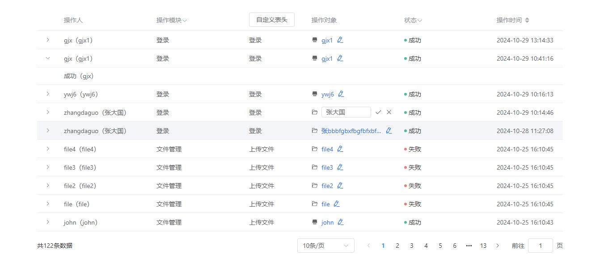
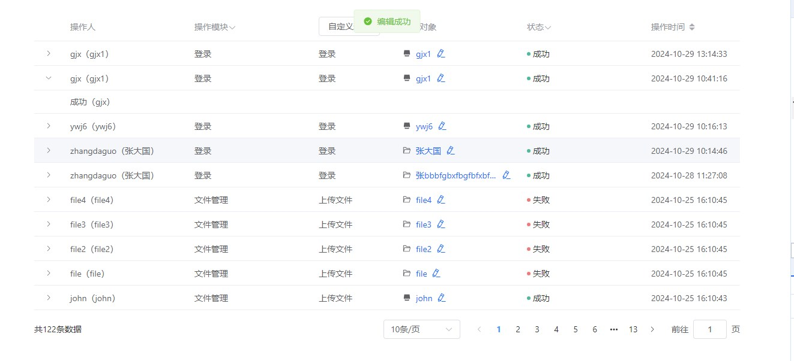

## 示例图片

<center class ='img'>


</center>

# 封装表格使用说明

## 接收参数

### 1.表格：tableObj（在父组件 computed 计算方法里面声明）

```json
const tableObj = computed(() => {
  let table = {
    data: tableData.value,
    option: tableOptions.value,
    config: {
      height:'300',//高度
      showHeader:true,//是否显示表头
      columnType:'selection', // selection(复选框) expand（展开） radio（单选框）
      hasRadio:true/false, //是否显示单选框
      hasSelection:true/false, //是否显示复选框
      defaultSort: { prop: 'startTime', order: 'descending' }.//默认排序
      rowKey:id, //为表格数据的唯一值，例如id、uuid
      defaultExpandAll: false ,//有展开列时，用该参数设置是否默认展开所有列
      reserveSelection:true// 仅对 type=selection 的列有效
    },
    operation: {
      label: '操作',//操作列
      width: operation.width || '120',
      fixed: operation.fixed || false,
      show: operation.show || false,
      minWidth: operation.minWidth || '',
      showIcon: operation.showIcon || false
    }
  }
  return table
})
```

### 2.tableOptions:

tableOptions 中的每一项的 width,min-width 都支持设置

```json
const tableOptions = computed(() => {
  let tableOptions = [
    {
      prop: 'applyPersonName',
      label: '申请人',
      showOverflowToolTip: true,
      show:true/false   //当前列是否显示
    },
    {
      prop: 'name', //如果无需修改，可以直接写后端返回的对应的 key
      showOverflowToolTip: true, //展示超出时鼠标悬浮提示
      fun: (row: any) => {
        goDetail(row) //点击进入详情页
      },
      label: '申请名称' //列名
    },
    {
      prop: 'applyPersonName',
      label: '申请人',
      showOverflowToolTip: true,
      headerRender: (row: any) => {   //自定义表头
        return h(
          ElButton,
          {
            onClick: btnClick
          },
          ['row.action + row.target']
        )
      },
    },
    {
      prop: 'status',
      label: '状态',
      showOverflowToolTip: true,
      filter: true,
      filterKey: 'status',
      selectOptions: statusOptions.value,
      render: (row: any) => {
        return h(statusItem, {
          row: row
        })
      }
    },
    //平台管理-账单管理-消费概览
    {
      prop: 'nameTxt',
      label: '项目名称',
      multipleTip: true, //鼠标悬浮，tooltip 有多个提示的情况
      multipleTipContent: 'multipleTipContent' //tooltip 中展示的内容
    },
      // 表格展开示例
    {
      prop: 'expand',
      label: '',
      render: (row: any) => {
        return h(
          'span',
          row.action ? row.status + '（' + row.userAccount + '）' : '-'
        )
      }
    },
  ]
  return tableOptions
})
```

### 3.分页：Pagination（没有特殊需求，在 data 中声明即可）

```json
const Pagination = reactive({
  pagingData: [10, 50, 100, 200],
  pageSize: 10,
  total: 0,
  currentPage: 1,
  show: true
})
```

### 4.方法

    分页:@pagingEvent="pagingChange"
    排序:@sortChange="sortChange"
    列表中的筛选事件：@filterChange="filterChange"
    当选择项发生变化时会触发该事件：@handleSelectionChange="handleSelectionChange"（handlerSelectAll，handlerSelect的触发 均会触发handleSelectionChange事件，一般情况下写这个事件就可以获取选中的行）
    当用户手动勾选全选 Checkbox 时触发的事件：@handlerSelectAll="handlerSelectAll"
    当用户手动勾选数据行的 Checkbox 时触发的事件：@handlerSelect="handlerSelect"

`<div>`
`  <basic-table`
`    ref="logTable"`
`    :Pagination="Pagination"`
`    @pagingEvent="pagingChange"`
`    :tableObj`
`    @sortChange="sortChange"`
`    @filterChange="filterChange"></basic-table>`
`</div>`

`<script lang="ts" setup>`
`import { ref, computed, reactive, h } from 'vue'`
`import { ElButton } from 'element-plus'`
`import statusItem from './status-item.vue'`
`import editName from './edit-name.vue'`
`const moduleOptions = ref([ `
`  { value: 'module_login', text: '登录' },`
`  { value: 'module_job', text: '作业管理' }`
`])`
`const statusOptions = ref([  `
`  { value: 'success', text: '成功' },`
`  { value: 'fail', text: '失败' }`
`])`
`const tableData = ref([{`
`      type: 'file',`
`      createtime: '2024-10-29 13:14:33',`
`      createpin: '',`
`      updatetime: null,`
`      updatepin: '',`
`      yn: 1,`
`      uuid: '6d995990-f629-4072-b237-93dc01115d97',`
`      userAccount: 'gjx',`
`      userName: 'gjx1',`
`      module: '登录',`
`      action: '登录',`
`      target: '',`
`      targetUuid: '6c219b34-db38-48d4-8dd0-a6e84454eacd',`
`      targetName: 'gjx',`
`      status: '成功',`
`      message: null,`
`      messageExtra: null,`
`      ip: '172.27.133.22',`
`      startTime: '2024-10-29 13:14:33',`
`      endTime: '2024-10-29 13:14:33'`
`    }])`
`const Pagination = reactive({`
`  pagingData: [10, 50, 100, 200],`
`  pageSize: 10,`
`  total: 100,`
`  currentPage: 1,`
`  show: true`
`})`

`const tableOptions = computed(() => {`
`  const tableOptions = [`
`  // 表格展开示例`
`    {`
`      prop: 'expand',`
`      label: '',`
`      render: (row: any) => {`
`      return h(`
`      'span',`
`      {`
`       class: 'mgl50'`
`      },`
`      row.action ? row.status + '（' + row.userAccount + '）' : '-'`
`      )`
`    }`
` },`
` {`
` prop: 'name',`
` label: '操作人',`
` showOverflowToolTip: true,`
`  render: (row: any) => {`
`  return h(`
`    'span',`
`    row.userAccount ? row.userAccount + '（' + row.userName + '）' : '-'`
`  )`
`}`
`},`
`{`
`  prop: 'module',`
`  label: '操作模块',`
`  showOverflowToolTip: true,`
`  filter: true,`
`  filterKey: 'module',`
`  selectOptions: moduleOptions.value`
`},`
`{`
`  prop: 'actionTxt',`
`  showOverflowToolTip: true,`
`  width: 140,`
`  label: '执行动作', // 自定义渲染表头示例`
`  headerRender: (row: any) => {`
`    return h(`
`      ElButton,`
`      {`
`        onClick: btnClick`
`      },`
`      ['自定义表头']`
`    )`
`  },`
`  render: (row: any) => {`
`    return h('span', row.action + row.target)`
`  }`
`},`
`{`
`  prop: 'operationName',`
`  showOverflowToolTip: true,`
`  label: '操作对象',`
`  render: (row: any) => {`
`    return h(editName)`
`  }`
`},`
`{`
`  prop: 'status',`
`  label: '状态',`
`  filter: true,`
`  filterKey: 'status',`
`  selectOptions: statusOptions.value,`
`  render: (row: any) => {`
`    return h(statusItem, {`
`      row: row`
`    })`
`  }`
`},`
`{`
`  prop: 'startTime',`
`  label: '操作时间',`
`  width: 160,`
`  sortProp: 'startTime'`
`}`
`]`
`return tableOptions`
`})`
`const tableObj = computed(() => {`
`  const table = {`
`    data: tableData.value,`
`    option: tableOptions.value,`
`    config: {`
`      defaultSort: { prop: 'startTime', order: 'descending' }`
`    }`
`  }`
`  return table`
`})`
`const pagingChange = (type: string, val: number) => {`
`  console.log(type,val,'分页')`
`})`
`const filterChange = (obj:any) => {`
`    console.log(obj,'筛选条件')`
`})`
`const btnClick = () => {`
`  console.log('自定义表头按钮点击事件')`
`}`
`const sortChange = (obj:any) => {`
`    console.log(obj,'排序条件')`
`})`
`</script>`
